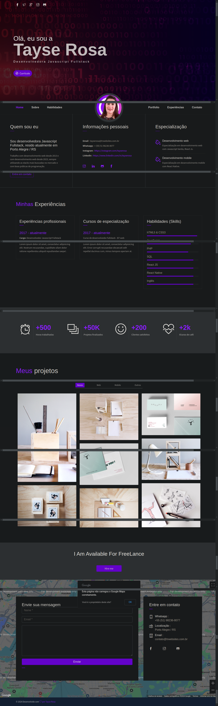

<h1 align="center"> Portfólio Tayse Rosa </h1>

<p align="center">Projeto de portfólio de desenvolvedor web / mobile </p>

<br>
🚀 Desenvolvedora:
<a href="https://www.tayserosa.com">
Tayse Rosa
</a>
<br>
🟢 Status do projeto: Em andamento
<br>
🔗 Link do projeto em funcionamento: https://www.trwebsites.com/portfolio

---
<p align="center">
  
</p>


## 🚀 Tecnologias Utilizadas neste projeto
<ul>
    <li>HTML</li>
    <li>CSS</li>
    <li>Javascript</li>
</ul>


## 🚀 Para você rodar o projeto
```
Digite no prompt de comando: 
git clone https://github.com/TayseRosa/portfolio-tayse-rosa.git
cd portfolio-tayse-rosa
abrir index.html no seu navegador de preferência
```

## Licença
Esse projeto está sob a licença MIT. Veja o arquivo [LICENSE](LICENSE.md) para mais detalhes.


## 📫 Contribuindo para Projeto

Para contribuir com Projeto, siga estas etapas:

1. Bifurque este repositório.
2. Crie um branch: `git checkout -b <nome_branch>`.
3. Faça suas alterações e confirme-as: `git commit -m '<mensagem_commit>'`
4. Envie para o branch original: `git push origin <nome_do_projeto> / <local>`
5. Crie a solicitação de pull.

Como alternativa, consulte a documentação do GitHub em [como criar uma solicitação pull](https://help.github.com/en/github/collaborating-with-issues-and-pull-requests/creating-a-pull-request).


<a href="https://www.tayserosa.com">
<p align="center">Feito com 💜 por Tayse Rosa</p>
</a>